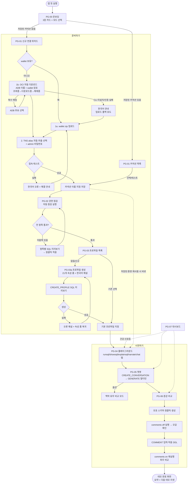
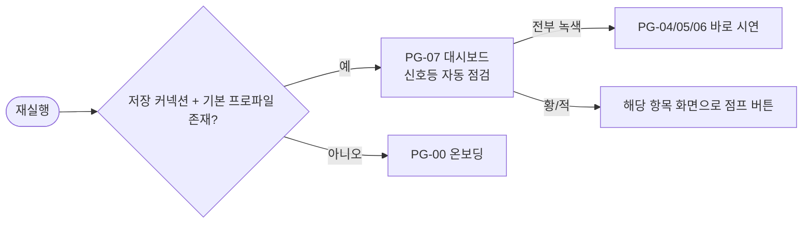

# UX 설계 문서 (design.md) — Select AI Demo Studio

| 항목 | 내용 |
|---|---|
| 문서 | UX/페이지 플로우 설계 v1.0 (2026-06-12) |
| 작성자 | UX 디자이너 (전문가 4/8) |
| 상위 문서 | `PRD.md` (FR-01~FR-10), `docs/research/selectai-reference.md` (기술 근거) |
| 대상 페르소나 | P1 Presales(전문가), P2 영업 대표(비기술), P3 파트너 엔지니어(학습자) |

---

## 0. 설계 전제 (PRD/아키텍처 결정 반영)

본 설계의 모든 화면은 아래 확정 사항을 UI 수준에서 강제한다.

1. **호출 패턴**: 모든 실행은 `DBMS_CLOUD_AI.GENERATE(prompt, profile_name, action, params)` 단일 패턴. `SELECT AI` 키워드·`SET_PROFILE`·`SET_CONVERSATION_ID`는 어떤 화면에서도 실행 SQL로 노출되지 않는다 (단, 학습용 해설 패널에서 "콘솔에서는 이렇게도 씁니다" 참고 표기는 허용).
2. **`showparameter` 액션 없음**: 액션 탭에 절대 포함하지 않는다. 프로파일 속성 조회는 `USER/DBA_CLOUD_AI_PROFILE_ATTRIBUTES` 뷰 기반 "속성 상세" 화면으로 제공.
3. **기본 프로파일은 앱 설정**: DB에 세션 프로파일을 설정하지 않는다. 헤더의 프로파일 선택기가 곧 앱 설정 값이며, 매 호출에 `profile_name` 명시 전달.
4. **ACL 분기**: provider=oci(기본)일 때 ACL 점검 항목은 "필요 없음(통과)" 상태로 표시. 외부 공급자 선택 시에만 활성화.
5. **교육적 투명성(원칙)**: 모든 실행성 버튼은 (a) 실행 전 SQL 미리보기, (b) 실행 후 "실행된 SQL" 펼침 영역을 갖는다. API 응답에 실행 SQL 원문이 포함된다는 전제.

---

## 1. 정보 구조 (IA)

### 1.1 전체 페이지/화면 목록

| ID | 페이지 | 경로(제안) | FR | 우선순위 |
|---|---|---|---|---|
| PG-00 | 온보딩 / 시작 화면 | `/` (첫 실행 시) | 공통 | P0 |
| PG-01 | 커넥션 관리 (목록 + 신규 연결 위저드) | `/connections` | FR-01, FR-02 | P0 |
| PG-02 | 권한 사전 점검 | `/permissions` | FR-03 | P0 |
| PG-03 | 프로파일 목록 | `/profiles` | FR-05 | P0 |
| PG-03a | 프로파일 생성/편집 (속성 폼 + 해설) | `/profiles/new`, `/profiles/:name/edit` | FR-04 | P0 |
| PG-03b | 프로파일 속성 상세 (읽기 전용) | `/profiles/:name` | FR-05 | P0 |
| PG-04 | Select AI 플레이그라운드 (액션 시연) | `/playground` | FR-06 | P0 |
| PG-05 | 챗봇 (Conversations) | `/chat` | FR-07 | P0 |
| PG-05a | 대화 목록/이력 관리 | `/chat/history` | FR-07 | P0 |
| PG-06 | Comment 증강 전/후 비교 | `/enrichment` | FR-08 | P0 |
| PG-07 | 데모 상태 대시보드 | `/dashboard` | FR-09 | P1 |
| PG-08 | 앱 설정 (기본 프로파일, 모드 전환, 데모 스키마 관리) | `/settings` | FR-05, 공통 | P0 |

### 1.2 내비게이션 구조

**좌측 사이드바 = 데모 여정 순서.** 메뉴 나열 순서 자체가 데모 진행 순서(stepper)와 일치하도록 배치한다. 비기술 사용자(P2)는 "위에서 아래로" 누르기만 하면 데모가 완성된다.

```
┌──────────────────────────────────────────────────────────────┐
│ [로고] Select AI Demo Studio    [커넥션▾] [프로파일▾] (●건강) │ ← 글로벌 헤더
├───────────────┬──────────────────────────────────────────────┤
│ 준비하기       │                                              │
│  ① 커넥션  ✓  │                                              │
│  ② 권한 점검 ✓│            (페이지 콘텐츠 영역)               │
│  ③ 프로파일 ✓ │                                              │
│ 시연하기       │                                              │
│  ④ 플레이그라운드                                             │
│  ⑤ 챗봇       │                                              │
│  ⑥ 증강 비교   │                                              │
│ 기타           │                                              │
│  대시보드      │                                              │
│  설정          │                                              │
├───────────────┴──────────────────────────────────────────────┤
│ [SQL 투명 모드 ⬤켜짐] [▣ SQL LOG (12)] 단순|전문가   v1.0    │ ← 글로벌 푸터(상태바)
└──────────────────────────────────────────────────────────────┘
```

**글로벌 헤더 구성 요소**:
- **커넥션 선택기**: 저장된 커넥션 드롭다운 + 연결 상태 점(녹/적). 마지막 사용 커넥션 자동 선택 (FR-02).
- **프로파일 선택기**: 앱 수준 "기본 프로파일" 표시·변경. 여기서 바꾸면 플레이그라운드/챗봇에 즉시 반영 (설계 전제 3).
- **건강 신호등**: FR-09 요약 점(녹/황/적). 클릭 시 대시보드(PG-07)로 이동. 황/적이면 시연 메뉴 진입 시 경고 배너.

**가드 레일(단계 잠금)**: 커넥션 없음 → ②~⑥ 메뉴 비활성(잠금 아이콘 + "먼저 커넥션을 연결하세요" 툴팁 + 클릭 시 ①로 유도). 권한 점검 실패 항목 존재 → ④~⑥ 진입은 허용하되 상단에 황색 경고 배너("권한 점검 미통과 항목 N건 — 데모 중 오류 가능") + 원클릭 이동 버튼. PRD §5 "이탈 지점 대응"의 UI 구현이다.

**모드 전환** (푸터):
- **단순 모드** (P2 기본): 시연 메뉴(④⑤⑥)와 추천 질문 칩 중심. 속성 폼·SQL 미리보기는 접힌 상태, 고급 입력 숨김.
- **전문가 모드** (P1/P3 기본): 모든 SQL 미리보기 기본 펼침, 고급 JSON 입력, 속성 미세 조정 노출.

### 1.3 글로벌 컴포넌트 — SQL 로그 터미널 (`SqlLogTerminal`)

**목적**: 앱이 DB에서 실행한 모든 SQL을 시계열 로그로 누적 표시하는, VS Code 통합 터미널 스타일의 하단 도킹 패널. "지금 이 클릭이 DB에서 무엇을 실행했는가"를 화면 전환 없이 추적하게 한다 (P1 진단 / P3 학습).

**위치와 레벨**: 사이드바·헤더·푸터와 같은 **앱 셸 구성 요소**다. DB Interaction이 발생하는 화면(PG-01~PG-07)에서 콘텐츠 영역과 글로벌 푸터 사이에 도킹된다. PG-00(읽기 전용)·PG-08(설정)에는 표시하지 않는다.

**데이터 소스**: 모든 API 응답 envelope의 `executed_sql[]` + `elapsed_ms`(api-spec §1.3)를 프런트엔드가 클라이언트 사이드에서 누적한다. **새 엔드포인트 불필요.** 로그는 전역 상태로 관리되어 페이지를 이동해도 세션 내 유지된다. 비밀 값은 api-spec §1.5의 `executed_sql` 마스킹 정책(`***MASKED***`)이 적용된 원문을 그대로 표시한다 — 패널 자체의 추가 마스킹 로직은 두지 않는다.

**로그 라인 형식**: `[HH:MM:SS] [페이지/기능 태그] SQL 텍스트 — 123ms`
- 예: `[14:02:31] [PG-04/runsql] SELECT DBMS_CLOUD_AI.GENERATE(...) FROM dual — 4210ms`
- 성공 = 기본색, 오류 = danger색(+ ORA 코드), 실행 중 = running색 스피너(완료 시 결과색으로 치환). SQL 구문 강조는 기존 SqlBlock과 동일 토큰 (style.md §5.9).

**상태 3종**: 닫힘(기본) / 열림(드래그로 높이 조절) / 최대화(콘텐츠 영역 전체, 복원 버튼).

**와이어프레임 (열림 상태)**:

```
┌──────────────────── (페이지 콘텐츠) ────────────────────────────┐
│                            …                                    │
├═════════ ↕ 드래그로 높이 조절 ═════════════════════════════════┤
│ SQL LOG (12)                          [지우기] [복사] [▢] [✕]  │ ← 패널 헤더 바
│ [14:02:31] [PG-04/runsql] SELECT DBMS_CLOUD_AI.GENERATE(       │
│            prompt => '…', profile_name => 'GENAI_SH',          │
│            action => 'runsql') FROM dual — 4210ms              │
│ [14:02:36] [PG-04/runsql] SELECT COUNT(*) FROM SH.customers…   │
│            — 380ms                                             │
│ [14:03:02] [PG-02/적용] BEGIN DBMS_CLOUD_ADMIN.… ✗ ORA-01031   │ ← 오류 = danger
│ [14:03:10] [PG-05/narrate] ◌ 실행 중…                          │ ← running 스피너
├─────────────────────────────────────────────────────────────────┤
│ [SQL 투명 모드 ⬤켜짐] [▣ SQL LOG (12)] 단순|전문가  v1.0       │ ← 글로벌 푸터(상태바)
└─────────────────────────────────────────────────────────────────┘
```

**show / no show 인터랙션 (VS Code 패턴)**:
- 경로 ⓐ: 글로벌 푸터(상태바)의 `▣ SQL LOG (n)` 항목 클릭 — 열기/닫기 토글.
- 경로 ⓑ: 키보드 단축키 **Ctrl/Cmd + `** — 어느 화면에서나 토글.
- 패널 헤더 바: ✕ = 닫기, ▢ = 최대화/복원, 지우기 = 로그 비우기(확인 불필요 — 파괴적 작업 아님, 클라이언트 상태만 삭제), 복사 = 전체 로그 클립보드 복사.
- 닫힌 상태에서는 푸터 상태바의 `SQL LOG (n)` 항목만 남는다. 새 로그 발생 시 **카운트 배지만 갱신하고 자동으로 열리지 않는다** (인터랙션 원칙 5 — 시연자 페이스 유지와 일치).

**SQL 투명 모드와의 관계 (중복 아닌 보완)**: 글로벌 푸터의 SQL 투명 모드 토글은 **각 화면 인라인**의 SQL 미리보기/펼침 기본 상태를 제어한다(원칙 1). SqlLogTerminal은 그와 **독립적으로 동작하는 시계열 누적 로그**로, 투명 모드가 꺼져 있어도 사용할 수 있다. 인라인 펼침 = "이 버튼이 실행한 SQL", 로그 터미널 = "지금까지 세션 전체의 SQL 흐름" — 두 장치는 같은 `executed_sql` 데이터를 다른 시점(時點)으로 보여준다.

---

## 2. 페이지 플로우

### 2.1 전체 화면 흐름 (mermaid)



### 2.2 재방문(저장된 환경) 단축 플로우



목표: 재사용 시나리오는 클릭 3회(커넥션 선택 → 대시보드 확인 → 시연 메뉴) 이내로 시연 화면까지 도달 (PRD 성공 지표 "재사용 ≤ 3분"). 실제 LLM 호출은 추천 질문 입력 후 명시적 [실행] 버튼으로만 시작한다.

---

## 3. 페이지별 상세 설계

> 공통 규칙 — 모든 페이지는 4가지 상태를 정의한다: **빈 상태**(empty), **로딩**(skeleton + 실행 중 SQL 표시), **오류**(ORA 코드 → 한국어 해설 매핑 + 조치 버튼), **정상**. LLM 호출은 수 초~수십 초 걸릴 수 있으므로 로딩 상태에 "지금 실행 중인 SQL"과 경과 시간을 항상 표시한다.

---

### PG-00. 온보딩 / 시작 화면

**목적**: 첫 실행 사용자가 30초 안에 "무엇을 할 수 있는 앱인지"와 "다음에 누를 버튼"을 알게 한다.

**레이아웃**:

```
┌────────────────────────────────────────────────────────┐
│            Select AI Demo Studio                       │
│   "말로 데이터를 묻는다 — 15분 안에 보여드립니다"        │
│                                                        │
│  ┌────────────┐ ┌────────────┐ ┌────────────┐          │
│  │ ① 연결한다  │ │ ② 질문한다  │ │ ③ 입증한다 │          │
│  │ wallet 업로드│ │ NL→SQL→결과│ │ 증강 전/후 │          │
│  └────────────┘ └────────────┘ └────────────┘          │
│                                                        │
│  사용 모드:  (•) 단순 모드 — 준비된 데모만 빠르게        │
│             ( ) 전문가 모드 — SQL과 속성까지 전부 보기   │
│                                                        │
│        [ 새 데이터베이스 연결하기 → ]                    │
│        ( 저장된 커넥션이 있으면: [ OOO으로 계속하기 → ] ) │
└────────────────────────────────────────────────────────┘
```

**주요 컴포넌트**: 3장 가치 카드, 모드 라디오, 주 CTA 1개(커넥션 유무에 따라 분기), "가이드 투어 시작" 보조 링크.

**상태**: 빈 상태가 곧 기본. 저장 커넥션 존재 시 "계속하기" CTA가 우선 노출. 오류 상태 없음(읽기 전용).

**사용자 액션**: 모드 선택(앱 설정 저장) → CTA 클릭 → PG-01.

---

### PG-01. 커넥션 관리 (FR-01 + FR-02)

**목적**: wallet zip 업로드(또는 wallet이 없으면 OCI CLI 자동 다운로드)만으로 ADB 26ai에 연결하고, 검증된 커넥션을 저장·재사용한다.

> 하단에 SQL 로그 터미널(`SqlLogTerminal`, §1.3) 도킹.

**레이아웃 — 목록 화면**:

```
┌ 커넥션 관리 ──────────────────────────────[+ 새 연결]─┐
│ ┌──────────────────────────────────────────────────┐  │
│ │ ● demo-adb-26ai          adb26ai_high   admin    │  │
│ │   마지막 사용: 오늘 09:12   [테스트] [사용] [삭제] │  │
│ ├──────────────────────────────────────────────────┤  │
│ │ ○ poc-customer-a         pocdb_medium   admin    │  │
│ │   테스트 실패: ORA-12506 (게이트웨이 타임아웃)     │  │
│ │   → 조치: ADB 인스턴스가 중지 상태인지 확인하세요  │  │
│ └──────────────────────────────────────────────────┘  │
│  빈 상태: "저장된 커넥션이 없습니다. [+ 새 연결]로      │
│           wallet zip을 업로드하세요."                  │
└────────────────────────────────────────────────────────┘
```

**레이아웃 — 신규 연결 위저드 (3단계 인라인 stepper, ①은 두 경로 분기)**:

```
┌ 새 연결  [① wallet]──[② 접속 정보]──[③ 테스트·저장] ──┐
│                                                        │
│ ① 경로 선택: (•) zip 업로드  ( ) Wallet이 없으신가요?   │
│              OCI에서 자동 다운로드                       │
│                                                        │
│ ①-a 업로드:                                            │
│    ┌ ─ ─ ─ ─ ─ ─ ─ ─ ─ ─ ┐                              │
│    │  Wallet_xxx.zip을    │   업로드 즉시 서버 검증:    │
│    │  끌어다 놓거나 클릭   │   tnsnames.ora 발견 ✓      │
│    └ ─ ─ ─ ─ ─ ─ ─ ─ ─ ─ ┘   cwallet.sso 발견 ✓        │
│                                                        │
│ ①-b 자동 다운로드 (OCI CLI):                            │
│    ADB 이름: [ DEMOADB        ]  wallet 암호: [ ****** ]│
│    컴파트먼트: [ TAEWAN.KIM (ocid1.compartment…umxq) ⓘ ]│
│      (기본값 — 변경 가능)   CLI 프로파일: [ DEFAULT ]   │
│    [ 다운로드 시작 ]  진행: 조회중 → 다운로드중 → 해제중 │
│    · 복수 매칭 시: ADB 후보 목록(이름/OCID/타입)에서 선택│
│    · CLI 미설치/인증 실패 시: "OCI CLI가 설치되어 있지   │
│      않습니다. 수동 업로드를 이용하거나 설치 가이드를    │
│      참조하세요" + [업로드로 전환] 폴백 버튼             │
│                                                        │
│ ② TNS 서비스 (zip에서 자동 추출):                       │
│    ( ) adb26ai_high   — 최고 성능, 동시성 낮음 ⓘ        │
│    (•) adb26ai_medium — 균형 (데모 권장) ⓘ              │
│    ( ) adb26ai_low    — 동시성 높음 ⓘ                   │
│    사용자: [ admin ] (고정)   비밀번호: [ ******** ]    │
│                                                        │
│ ③ [ 접속 테스트 ]                                       │
│    ✓ 접속 성공 — Oracle AI Database 26ai / 인스턴스     │
│      DEMOADB / 현재 사용자 ADMIN                        │
│    커넥션 이름: [ demo-adb-26ai ]      [ 저장하고 계속 ]│
└────────────────────────────────────────────────────────┘
```

**주요 컴포넌트**: ① 경로 토글(업로드 / 자동 다운로드), 드래그앤드롭 업로더(zip 내용 검증 결과 체크리스트), **자동 다운로드 폼**(ADB 표시 이름·wallet 암호·컴파트먼트 OCID — 기본값 TAEWAN.KIM 표시, 변경 가능·CLI 프로파일 기본 DEFAULT / 진행 상태 3단계 표시 / 복수 매칭 시 후보 선택 리스트 / 실패 시 [업로드로 전환] 폴백 — api-spec §2.7), TNS alias 라디오(자동 추출, 각 레벨 한국어 해설 툴팁 — 두 경로가 이 단계로 합류), 비밀번호 입력(표시 토글, 절대 평문 에코 없음), 접속 테스트 버튼(5초 타임아웃 진행 표시), 결과 카드(DB 버전/인스턴스/사용자).

**상태**:
- 빈 상태: 목록 비어 있음 → 신규 연결 CTA 강조.
- 로딩: 업로드 중 진행률, 자동 다운로드 중 단계 표시(조회중 → 다운로드중 → 해제중, 수십 초 가능 안내), 테스트 중 "접속 시도 중… (최대 5초)" 스피너.
- 오류: zip 파일 누락/형식 오류("tnsnames.ora를 찾을 수 없습니다 — ADB 콘솔에서 'Instance Wallet'을 다시 다운로드하세요"), 비밀번호 불일치(ORA-01017 → "admin 비밀번호를 확인하세요"), 네트워크/타임아웃, **자동 다운로드 실패**(CLI 미설치/인증 실패 → 한국어 안내 + 업로드 폴백 버튼, ADB 0건/복수 매칭 → 재입력 또는 후보 선택). 모든 오류는 원문(접기) + 한국어 해설 + 조치 버튼. 자동 다운로드의 실행 CLI 명령은 `--password` 마스킹본으로 SQL 로그 터미널(§1.3)에 누적된다.

**사용자 액션**: 업로드 또는 자동 다운로드 → alias 선택 → 비밀번호 → 테스트 → 저장 → 자동으로 PG-02로 이동 제안("권한 점검을 시작할까요?").

---

### PG-02. 권한 사전 점검 (FR-03)

**목적**: Select AI 사전 요구사항을 신호등 체크리스트로 보여주고, 미충족 항목을 SQL 미리보기와 함께 원클릭 적용한다.

> 하단에 SQL 로그 터미널(`SqlLogTerminal`, §1.3) 도킹.

**레이아웃**:

```
┌ 권한 사전 점검   대상: demo-adb-26ai (admin)  [전체 재점검]┐
│ AI 공급자 전제: [ OCI Generative AI ▾ ]  ← 분기 기준       │
│                                                            │
│ ✓ DBMS_CLOUD_AI EXECUTE 권한        통과                   │
│    └ 근거 SQL 보기 ▸ (DBA_TAB_PRIVS 조회문)                │
│ ✓ 네트워크 ACL                      필요 없음               │
│    └ ⓘ OCI Generative AI는 ACL이 필요 없습니다 (가이드 p34)│
│      외부 공급자(openai 등) 선택 시에만 점검합니다.         │
│ ✗ AI 자격증명                       미충족                  │
│    └ 방법 A: Resource Principal (권장 — 키 관리 불필요)     │
│       [실행될 SQL 보기 ▾]                                   │
│         BEGIN                                              │
│           DBMS_CLOUD_ADMIN.ENABLE_PRINCIPAL_AUTH(          │
│             provider => 'OCI');                            │
│         END;                                               │
│       ⚠ 사전 조건: 테넌시 Dynamic Group + IAM 정책 (안내 ▸)│
│       [ 적용 ]                                             │
│      방법 B: API 서명 키 credential [폼 열기 ▸]            │
│ ✓ Data Access 상태                  활성 (narrate 가능)    │
│    └ ⓘ 비활성이면 narrate·합성데이터가 ORA-20000으로 실패  │
│      합니다. [비활성 시: ENABLE_DATA_ACCESS 원클릭 복구]    │
│ ◌ V_$MAPPED_SQL/V_$SESSION READ     해당없음 (P1·feedback) │
│                                                            │
│  진행: 3/4 통과 ─ [ 미충족 항목 모두 적용 ] [다음: 프로파일]│
└────────────────────────────────────────────────────────────┘
```

**주요 컴포넌트**: 항목별 상태 칩(통과 ✓녹 / 미충족 ✗적 / 필요 없음·해당없음 ◌회), 근거 SQL 접기, 적용 전 SQL 전문 미리보기(필수 — P3 학습 효과), Resource Principal vs API 키 선택 카드(O1 결정 반영: Resource Principal 기본·"권장" 배지, API 서명 키는 폴백 — architecture.md §6.4), 적용 후 자동 재점검.

**점검 항목 정의** (레퍼런스 §4 기준):
1. `DBMS_CLOUD_AI` EXECUTE — `DBA_TAB_PRIVS` 조회. (admin 접속이라 통상 통과 — "시연용" 배지로 일반 사용자 grant 위저드 분리)
2. 네트워크 ACL — provider=oci면 자동 "필요 없음". 외부 공급자 선택 시 공급자별 host로 `APPEND_HOST_ACE` 미리보기+적용.
3. AI 자격증명 — `OCI$RESOURCE_PRINCIPAL` 또는 `DBMS_CLOUD.CREATE_CREDENTIAL`(user_ocid/tenancy_ocid/private_key/fingerprint 폼).
4. Data Access 상태 — 비활성 시 적색 + `ENABLE_DATA_ACCESS` 원클릭 복구.
5. (P1, feedback 사용 시) `SYS.V_$MAPPED_SQL`/`SYS.V_$SESSION` READ grant.

**상태**: 로딩 = 항목별 순차 점검 애니메이션(체크리스트가 위에서 아래로 채워짐 — 데모 현장 신뢰감). 오류 = 점검 쿼리 자체 실패 시 항목에 "점검 불가" + 원인. 빈 상태 없음(커넥션 가드로 진입 보장).

**사용자 액션**: 공급자 선택(프로파일 기본값과 연동) → 미충족 항목 적용(개별/일괄) → 전 항목 녹색 → "다음: 프로파일" CTA.

---

### PG-03 / PG-03a / PG-03b. 프로파일 (FR-04 + FR-05)

> 세 화면 모두 하단에 SQL 로그 터미널(`SqlLogTerminal`, §1.3) 도킹.

#### PG-03. 프로파일 목록

```
┌ 프로파일 ──────────────────────────────[+ 새 프로파일]─┐
│ ┌────────────────────────────────────────────────────┐ │
│ │ ★ GENAI_SH        oci · meta.llama-3.3-70b-instruct│ │
│ │   기본 프로파일(앱 설정) · 사용 가능                 │ │
│ │   [상세] [편집] [복제] [삭제]                        │ │
│ ├────────────────────────────────────────────────────┤ │
│ │   ENRICH_DEMO_OFF    oci · comments: false          │ │
│ │   증강 비교용 (PG-06에서 자동 생성됨)                │ │
│ └────────────────────────────────────────────────────┘ │
│ 빈 상태: "프로파일이 없습니다. Select AI는 프로파일이    │
│ 있어야 동작합니다. [+ 새 프로파일]" + 3줄 개념 해설      │
└─────────────────────────────────────────────────────────┘
```

- 데이터 소스: `USER/DBA_CLOUD_AI_PROFILES` 뷰. ★ = 앱 수준 기본 프로파일(클릭으로 변경, DB 호출 없음 — 설계 전제 3).
- 삭제 = `DROP_PROFILE` 미리보기 + 확인 다이얼로그. (P1) ENABLE/DISABLE 토글.

#### PG-03a. 프로파일 생성/편집 — **속성 폼 + 한국어 해설 (학습 효과 핵심 화면)**

**레이아웃 — 좌: 폼 / 우: 해설 패널 + SQL 미리보기 (2단 고정)**:

```
┌ 새 프로파일 ───────────────────────────────────────────────────┐
│ ┌─ 입력 폼 (좌 55%) ──────────────┐ ┌─ 해설 패널 (우 45%) ────┐ │
│ │ 프로파일 이름 [GENAI_SH      ]  │ │ ▣ 지금 선택한 속성:      │ │
│ │                                 │ │   object_list            │ │
│ │ ▾ 기본 (필수)                   │ │ ─────────────────────── │ │
│ │  provider     [oci ▾]        ⓘ │ │ NL2SQL 대상 객체의 JSON  │ │
│ │  credential   [OCI$RESOURCE_…▾]ⓘ│ │ 배열입니다. 미지정 시    │ │
│ │  model        [meta.llama-3.3…▾]ⓘ│ │ 현재 스키마 전체가 자동  │ │
│ │  region       [us-chicago-1 ▾] ⓘ │ │ 선택됩니다. 테이블을     │ │
│ │  oci_compartment_id [TAEWAN.…] ⓘ │ │ 좁힐수록 정확도가 올라   │ │
│ │                                 │ │ 갑니다.                  │ │
│ │ ▾ 대상 객체 (object_list)       │ │ 근거: 가이드 p78, p151   │ │
│ │  [스키마/테이블 브라우저]        │ │ ─────────────────────── │ │
│ │   ☑ SH.customers  ☑ SH.countries│ │ ▣ CREATE_PROFILE 미리보기│ │
│ │   ☑ SH.products   ☐ SH.profits  │ │ BEGIN                   │ │
│ │  [JSON 직접 입력으로 전환]       │ │  DBMS_CLOUD_AI.CREATE_  │ │
│ │                                 │ │  PROFILE(               │ │
│ │ ▾ 메타데이터 증강               │ │   profile_name=>'GENAI_ │ │
│ │  comments    (○ false ● true) ⓘ│ │   SH',                  │ │
│ │  annotations (● false ○ true) ⓘ│ │   attributes=>'{...}'); │ │
│ │  constraints (● false ○ true) ⓘ│ │ END;                    │ │
│ │ ▾ 동작 제어                     │ │ (입력과 실시간 동기화,   │ │
│ │  conversation, temperature,     │ │  [복사] 버튼)            │ │
│ │  max_tokens, enforce_object_list,│ └─────────────────────────┘ │
│ │  case_sensitive_values,         │                              │
│ │  object_list_mode …          ⓘ │   [ 취소 ]  [ 프로파일 생성 ]│
│ │ ▾ 고급 — JSON 직접 입력 ⚠      │                              │
│ │  (미검증 속성은 여기에만)        │                              │
│ └─────────────────────────────────┘                              │
└──────────────────────────────────────────────────────────────────┘
```

**핵심 인터랙션 — 속성 해설**:
- 모든 필드 옆 `ⓘ`에 **호버 = 한 줄 요약 툴팁**, **클릭/포커스 = 우측 해설 패널에 상세 해설 고정**(해설 문구는 레퍼런스 §3 표의 한국어 해설 그대로 + 근거 페이지 표기). 키보드 탐색만으로도 패널이 따라온다.
- 검증 21개 속성만 폼 필드로 제공 (architecture.md 원칙 5 — 속성 화이트리스트, PRD R4). 그 외 속성은 "고급 — JSON 직접 입력" 섹션에 격리하고 경고 문구("이 가이드에서 검증되지 않은 속성은 오류가 발생할 수 있습니다") 표기.
- 속성 그룹핑: 기본(필수) / 대상 객체 / 메타데이터 증강 / 동작 제어 / 공급자별(oci_apiformat·oci_endpoint_id·azure_*·provider_endpoint·target_language·vector_index_name) / 고급 JSON. 공급자별 그룹은 선택한 provider에 따라 동적 표시.
- **대상 객체(object_list) 브라우저 — 스키마/테이블 선택 (FR-04 핵심)**: "대상 객체" 그룹은 `GET /api/v1/schema/owners`·`/schema/tables`로 **인증한 커넥션 사용자(admin)가 DB에서 실제로 볼 수 있는** 스키마·테이블만 노출한다 (`ALL_*` 뷰 기반). 동작:
  - 스키마 선택기는 인증 사용자 자신의 스키마(`is_current=true`)를 **기본 선택**한다 — "인증한 스키마에서 보이는 테이블"이 곧바로 후보가 된다. 드롭다운으로 SH 등 접근 가능한 다른 스키마로 전환 가능.
  - 테이블 목록은 체크박스(전체 선택/검색 필터 포함). 체크한 `{owner, table_name}`이 그대로 `object_list`의 `ObjectRef`(`{owner, name}`)로 매핑되어 우측 `CREATE_PROFILE` 미리보기와 실시간 동기화된다. 여러 스키마의 테이블을 섞어 담을 수 있다.
  - **아무것도 선택하지 않으면** `object_list`를 생략 → "현재 스키마 전체 자동 선택"(가이드 p78·p151)이 적용된다. 해설 패널이 이 동작과 "테이블을 좁힐수록 NL2SQL 정확도가 올라감"을 안내한다.
  - [JSON 직접 입력으로 전환] 토글로 `object_list`를 손으로 편집하는 고급 경로도 제공(브라우저 선택과 양방향 동기화).
  - [프로파일 생성]을 누르면 선택한 object_list를 포함한 `DBMS_CLOUD_AI.CREATE_PROFILE`이 호출되고, 생성된 프로파일은 X2 리소스 대장에 기록된다.
- **연동 경고**: 외부 공급자 선택 시 인라인 경고 "이 공급자는 네트워크 ACL이 필요합니다 → [권한 점검으로 이동]" (FR-03 연동). deprecated 모델 선택 시 배지 표시.
- 기본값 자동 채움: provider=oci, model=meta.llama-3.3-70b-instruct, region=us-chicago-1, oci_compartment_id=TAEWAN.KIM OCID, credential=권한 점검에서 만든 자격증명.
- **SQL 미리보기 실시간 동기화**: 폼 입력이 바뀔 때마다 우측 하단 `CREATE_PROFILE` PL/SQL이 갱신 — "폼 = SQL"이라는 학습 효과의 핵심 장치.

**상태**: 로딩 = 객체 브라우저 스키마 조회 스켈레톤 / 생성 중 버튼 스피너. 오류 = 생성 실패 시 ORA 원문 + 한국어 해설(예: 자격증명 누락 → 권한 점검 이동 버튼) + 폼 값 보존. 빈 상태 = 객체 브라우저에서 스키마 무객체 시 "데모 스키마 셋업" 안내.

#### PG-03b. 프로파일 속성 상세 (읽기 전용)

- 데이터 소스: `USER/DBA_CLOUD_AI_PROFILE_ATTRIBUTES` 뷰 (**"showparameter" 대체** — 화면 상단에 학습 메모: "Select AI에는 showparameter 액션이 없습니다. 속성 조회는 이 뷰를 사용합니다").
- 속성명/현재값 표 + 각 행에 동일한 한국어 해설 패널. [편집] → PG-03a, [기본 프로파일로 지정] 버튼.

---

### PG-04. Select AI 플레이그라운드 (FR-06)

**목적**: 같은 자연어 질문 하나를 액션만 바꿔 실행하며 "Select AI가 무엇을 하는지"를 단계별로 보여준다.

> 하단에 SQL 로그 터미널(`SqlLogTerminal`, §1.3) 도킹.

**레이아웃**:

```
┌ 플레이그라운드     프로파일: [GENAI_SH ▾]   ⏱ 응답시간 표시 ┐
│                                                              │
│ 질문: [ how many customers in San Francisco are married  ] 🔍│
│ 추천: (how many customers exist) (top 3 customers in SF)     │
│       (break out customers by country)        ← SH 검증 칩   │
│                                                              │
│ ┌─[runsql]─[showsql]─[explainsql]─[narrate]─[chat]─(P1:showprompt)─┐
│ │                                                            │
│ │  ▣ runsql — 생성된 SQL을 실행해 결과를 표로 반환 ⓘ         │
│ │  ┌──────────────────────────────┐                          │
│ │  │ CUSTOMER_COUNT               │   (결과 grid,            │
│ │  │ 18520                        │    CSV 복사/다운로드)    │
│ │  └──────────────────────────────┘                          │
│ │  ⏱ 4.2s                                                    │
│ │                                                            │
│ │  ▸ 이 결과를 만든 실제 호출 SQL 보기                        │
│ │    SELECT DBMS_CLOUD_AI.GENERATE(                          │
│ │      prompt       => 'how many customers in San Francisco  │
│ │                       are married',                        │
│ │      profile_name => 'GENAI_SH',                           │
│ │      action       => 'runsql') FROM dual;                  │
│ │  ▸ (runsql/showsql일 때) LLM이 생성한 SQL 보기 [구문 강조] │
│ └────────────────────────────────────────────────────────────┘
│ 액션 비교 모드: [ 모든 P0 액션 한 번에 실행 → 5열 비교 ]      │
└──────────────────────────────────────────────────────────────┘
```

**주요 컴포넌트**:
- **액션 탭 5개(P0)**: runsql / showsql / explainsql / narrate / chat. 각 탭 헤더에 한 줄 한국어 정의 ⓘ(레퍼런스 §1 액션 표 문구). **탭 전환 시 질문은 유지**되고 해당 액션으로 재실행 버튼 활성 — "같은 질문, 다른 액션"의 차이가 핵심 시연. P1에서 showprompt 탭 추가(증강 프롬프트 원문 뷰어), feedback은 runsql/showsql 결과 카드의 👍/👎 버튼으로 통합. **showparameter 탭은 존재하지 않는다.**
- **액션 비교 모드**(보조): 한 번 클릭으로 5개 액션을 병렬 실행해 5열 카드로 나란히 표시 — P2 페르소나용 "한 방" 시연.
- **추천 질문 칩**: SH 스키마 검증 프롬프트(레퍼런스 §9) 사전 탑재. 칩 클릭 = 입력창 채움(자동 실행 아님 — 시연자가 말할 시간 확보).
- **결과 카드 (액션별 차등)**: runsql=표 grid, showsql=SQL 구문 강조(실행 안 됨 배지), explainsql=SQL+자연어 설명 2단, narrate=서술 텍스트(말풍선 스타일), chat=일반 텍스트.
- **실행 SQL 펼침(필수)**: 모든 결과 카드 하단에 실제 호출된 `GENERATE` SQL 전문(설계 전제 5). 전문가 모드에서는 기본 펼침.
- 응답 시간 배지, 작은따옴표 자동 이스케이프(백엔드, UI에는 안내 불필요), 재시도 버튼.

**상태**:
- 빈 상태: 결과 영역에 "추천 질문을 클릭하거나 직접 입력하세요" + 액션 5개 개념 다이어그램(질문→SQL→실행→서술 파이프라인 그림).
- 로딩: 카드 자리에 스켈레톤 + "LLM 호출 중… (실행 SQL 미리 표시)" + 경과 초.
- 오류: LLM 환각/SQL 실패(가이드 공식 경고) → "생성된 SQL이 실행에 실패했습니다" + ORA 원문 접기 + 한국어 해설 + [재시도] [질문 바꿔보기 제안]. narrate에서 ORA-20000 → "Data Access가 비활성입니다 → [권한 점검에서 활성화]" 딥링크.

**사용자 액션**: 질문 입력/칩 클릭 → 액션 탭 선택 → 실행 → SQL 펼쳐 설명 → 탭 전환 재실행 → (옵션) 비교 모드.

---

### PG-05 / PG-05a. 챗봇 (FR-07)

**목적**: Conversations 기반 멀티턴 챗봇으로 "맥락을 기억하는 데이터 대화"를 시연한다.

> 두 화면 모두 하단에 SQL 로그 터미널(`SqlLogTerminal`, §1.3) 도킹.

**레이아웃**:

```
┌ 챗봇   대화: [고객 분석 데모 ▾] [+새 대화] [이력]  프로파일: [GENAI_SH ▾] ┐
│ 턴 액션: (•) narrate  ( ) chat  ( ) runsql  ( ) showsql  ( ) explainsql ⓘ│
│ ┌──────────────────────────────────────────────────────────┐│
│ │ 나: what are the total number of customers               ││
│ │ AI: There are 55,500 customers in total.        ▸SQL ⏱3s ││
│ │ 나: break out count of customers by country               ││
│ │ AI: (국가별 분포 서술…)  ← 이전 질문 맥락 유지!  ▸SQL     ││
│ │     ⓘ 'count of customers'가 무엇인지 직전 턴에서 이해     ││
│ └──────────────────────────────────────────────────────────┘│
│ 추천 후속 질문: (break out by country) (top 5 with rank)     │
│ [ 메시지 입력…                                    ] [전송]   │
│ ───────────────────────────────────────────────────────────│
│ [ 맥락 비교 모드 켜기 ] ← 토글 시 아래 2열 분할              │
│ ┌─ conversation_id 없음 ──────┐ ┌─ conversation_id 있음 ──┐ │
│ │ "break out by country"      │ │ "break out by country"   │ │
│ │ → 무엇을 나누라는지 모름/    │ │ → 고객 수를 국가별 분해  │ │
│ │   엉뚱한 답                 │ │   (맥락 유지)            │ │
│ │ ▸ 실행 SQL (params 없음)    │ │ ▸ 실행 SQL (params에     │ │
│ │                             │ │   conversation_id 포함)  │ │
│ └─────────────────────────────┘ └──────────────────────────┘ │
└──────────────────────────────────────────────────────────────┘
```

**주요 컴포넌트**:
- **새 대화 다이얼로그**: title/description/retention_days/conversation_length 입력(기본값 채움, 각 필드 한국어 해설). 생성 = `CREATE_CONVERSATION` 함수 호출 → 반환된 UUID를 대화 칩에 표시(전문가 모드) — "이 UUID가 모든 턴의 params로 들어갑니다" 학습 포인트.
- **턴 액션 선택기**: 대화 지원 액션 5종(runsql/showsql/explainsql/narrate/chat — p47 Note)만 라디오로 제공, 기본 narrate. 턴마다 변경 가능.
- **메시지 버블**: AI 버블마다 ▸실행 SQL 펼침(`GENERATE(..., params=>'{"conversation_id":"…"}')` 원문) + 응답 시간. 맥락 활용이 일어난 턴에 ⓘ 학습 배지.
- **맥락 비교 모드**: 동일 질문을 conversation_id 유/무로 동시 실행해 좌우 비교(p132 근거). 각 열 하단에 실행 SQL — params 차이가 한눈에 보이게 diff 강조.
- 추천 후속 질문 칩: 레퍼런스 §9 대화형 시나리오(total → by country → age group → top 5 with rank) 순서대로 다음 칩 제안.

**PG-05a 대화 이력**: `USER_CLOUD_AI_CONVERSATIONS` 목록(제목/보관일/길이) + 행 펼침으로 `USER_CLOUD_AI_CONVERSATION_PROMPTS` 턴 이력 + [이 대화 이어가기] [삭제(`DROP_CONVERSATION` 미리보기)] 버튼.

**상태**: 빈 상태 = "새 대화를 만들어 시작하세요" + 멀티턴 개념 그림. 로딩 = AI 버블 타이핑 인디케이터 + 경과 초. 오류 = 턴 실패 시 버블 내 오류 카드(대화는 유지, 해당 턴만 재시도). narrate 턴의 ORA-20000 → Data Access 딥링크.

**사용자 액션**: 새 대화 → 추천 칩 순서대로 멀티턴 → SQL 펼쳐 conversation_id 설명 → 비교 모드로 마무리.

---

### PG-06. Comment 증강 전/후 비교 (FR-08, 차별화 핵심)

**목적**: "메타데이터(COMMENT)가 좋아지면 NL2SQL이 정확해진다"를 5단계 가이드 + 좌우 비교 한 화면으로 입증한다.

> 하단에 SQL 로그 터미널(`SqlLogTerminal`, §1.3) 도킹.

**레이아웃 — 상단 stepper + 본문 단계별 전환, 5단계는 좌우 분할**:

```
┌ 증강 비교  [①스키마]─[②전(off)]─[③COMMENT]─[④후(on)]─[⑤비교] ┐
│                                                                │
│ ① 모호 스키마 준비                                             │
│    "컬럼명이 c1, c2 … c7인 무비 테이블을 만듭니다.             │
│     사람도 못 알아보는 스키마 — LLM도 마찬가지입니다."          │
│    [ 데모 스키마 원클릭 생성 ]  ▸ 실행될 DDL 보기               │
│    (이미 존재 시: "준비됨 ✓ [초기화 후 재생성]")                │
│                                                                │
│ ② 증강 전 실행 — 프로파일 ENRICH_DEMO_OFF (comments:"false")   │
│    질문: [ what are our total views ] (칩 제공)                │
│    [실행] → 생성 SQL: SELECT SUM(QUANTITY_SOLD)… ✗ 오답 강조   │
│    ⓘ "c7이 '시청 수'라는 걸 LLM이 알 수 없어 엉뚱한 컬럼 선택" │
│                                                                │
│ ③ COMMENT 입력·적용                                            │
│    ┌ 테이블/컬럼 ─┬ 현재 COMMENT ─┬ 새 COMMENT ──────────────┐ │
│    │ table1       │ (없음)        │ [Contains movies, …    ] │ │
│    │ table1.c1    │ (없음)        │ [movie ids. Use this …  ] │ │
│    │ table2.c7    │ (없음)        │ [number of views, …     ] │ │
│    └──────────────┴───────────────┴──────────────────────────┘ │
│    [추천 COMMENT 자동 채우기]  ▸ 실행될 COMMENT DDL 보기 [적용] │
│                                                                │
│ ④ 증강 후 실행 — 프로파일 ENRICH_DEMO_ON (comments:"true")     │
│    (전/후 프로파일 쌍은 ①에서 자동 생성됨)  동일 질문 [재실행] │
│                                                                │
│ ⑤ 좌우 비교                                                    │
│ ┌─ 증강 전 (comments off) ────┐ ┌─ 증강 후 (comments on) ────┐ │
│ │ 생성 SQL (오답, 적색 테두리) │ │ 생성 SQL (정답, 녹색 테두리)│ │
│ │ SELECT SUM(QUANTITY_SOLD)…  │ │ SELECT SUM(c7) FROM table2…│ │
│ │ 실행 결과: (틀린 값/오류)    │ │ 실행 결과: 1,234,567       │ │
│ │ ▸ 실행된 GENERATE SQL       │ │ ▸ 실행된 GENERATE SQL      │ │
│ └─────────────────────────────┘ └────────────────────────────┘ │
│  차이 요약: "COMMENT 7건 추가만으로 올바른 컬럼(c7)을 선택"     │
│  (P1) [▸ showprompt로 증강 프롬프트에 포함된 COMMENT 확인]      │
│  [다른 질문으로 다시 비교] [데모 완료 →]                        │
└────────────────────────────────────────────────────────────────┘
```

**주요 컴포넌트**: 단계 stepper(완료 체크 누적, 이전 단계 자유 복귀), 원클릭 스키마 생성(레퍼런스 §9 모호 무비 테이블 패턴 + 전/후 프로파일 쌍 `comments:"false"/"true"` 자동 생성 — FR-08 수용 기준), COMMENT 편집 표(추천 문구 자동 채우기 = 레퍼런스 §7 예제 문구, DDL 미리보기 필수), 좌우 비교 카드(SQL diff 하이라이트 — 달라진 컬럼/테이블명 강조), 차이 요약 한 줄.

**상태**: 빈 상태 = ①만 활성, 나머지 단계 잠금. 로딩 = 단계별 버튼 스피너 + 실행 SQL/DDL 표시. 오류 = 스키마 생성 충돌("이미 존재 — 초기화하시겠습니까?"), 전 단계 실행 실패 시에도 "오답도 데모의 일부입니다" 안내(LLM이 우연히 맞히면 "다른 질문으로 재시도" 칩 제안 — R1 완화). 재실행 시 ⑤ 비교는 항상 최신 쌍으로 갱신.

**사용자 액션**: ①생성 → ②오답 확인 → ③COMMENT 적용 → ④재실행 → ⑤비교·요약 → 완료 화면(데모 전체 요약 + [환경 리셋] [처음부터 다시]).

---

### PG-07. 데모 상태 대시보드 (FR-09, P1)

**목적**: 데모 직전 30초 안에 "지금 시연 가능한가"를 한 화면에서 확인한다.

> 하단에 SQL 로그 터미널(`SqlLogTerminal`, §1.3) 도킹.

```
┌ 데모 상태                              [전체 재점검 ↻] ┐
│  ● 커넥션          demo-adb-26ai 연결 정상      [관리] │
│  ● 권한 점검        4/4 통과                     [보기] │
│  ● Data Access      활성 (narrate 가능)          [보기] │
│  ● 기본 프로파일    GENAI_SH 유효                [보기] │
│  ◐ 데모 스키마      SH ✓ / 무비(증강용) 미생성   [생성] │
│  ─────────────────────────────────────────────────────│
│  종합: ◐ 시연 가능 (증강 비교 데모만 준비 필요)        │
│  [ 플레이그라운드로 → ] [ 챗봇으로 → ] [ 증강 비교로 → ]│
└────────────────────────────────────────────────────────┘
```

- 신호등 3색(녹=가능/황=일부 제한/적=불가) + 각 행에 해당 화면 딥링크. 헤더 건강 점과 동일 데이터.
- 상태: 로딩 = 행별 순차 점검. 오류 = 행 단위 "점검 불가" 표시(전체 차단 없음).

---

### PG-08. 앱 설정

- 기본 프로파일(서버 앱 설정 저장 — 설계 전제 3), 단순/전문가 모드, SQL 투명 모드 기본값, 데모 스키마 관리(생성/초기화/삭제), 대화 정리 옵션(O4 결정 반영: retention_days 기본 7일·자동 삭제 없음, 수동 일괄 삭제 제공 — architecture.md §5.2), 저장 자격 정보 일괄 삭제.
- **저장 위치 결정(X4)**: 기본 프로파일만 `GET/PUT /api/v1/settings/default-profile`로 백엔드에 저장한다. 단순/전문가 모드, SQL 투명 모드, 가이드 투어 재표시 여부는 표시 수준 preference이므로 프런트 `localStorage`에 저장하고 백엔드 API를 만들지 않는다.
- **데모 환경 정리(X2, P0)**: "데모 환경 정리" 섹션은 `GET /api/v1/resources`로 생성 리소스 대장(`~/.selectai/resources.json`)을 읽어 프로파일/credential/ACL/대화/데모 테이블/grant/wallet 정리 대상을 보여준다. 개별 항목은 `DELETE /api/v1/resources/{id}`로, [전체 정리 실행]은 `POST /api/v1/resources/cleanup`을 호출하며, 실행 전 SQL/파일 삭제 작업 미리보기와 확인 다이얼로그를 반드시 거친다.
- 상태: 단순 폼. 파괴적 작업(스키마 삭제, Cleanup 실행 등)은 확인 다이얼로그 + 실행 SQL/작업 미리보기.

---

## 4. 데모 진행 보조 장치 (비기술 사용자용)

| 장치 | 설명 | 적용 위치 |
|---|---|---|
| **여정 stepper** | 사이드바 "준비하기 ①②③ → 시연하기 ④⑤⑥" 자체가 진행 표시. 완료 단계 ✓, 현재 단계 강조, 미충족 선행 단계 잠금+이유 툴팁 | 전 화면 |
| **가이드 투어** | 첫 방문 시 페이지별 3~5개 코치마크(입력창 → 액션 탭 → SQL 펼침 순). "다시 보지 않기" + 설정에서 재실행 가능 | PG-04/05/06 우선 |
| **추천 질문 칩** | SH 검증 프롬프트(레퍼런스 §9)와 증강 비교 질문을 사전 탑재. 클릭 = 입력 채움(자동 실행 아님). 챗봇은 "다음 후속 질문" 순차 제안 | PG-04/05/06 |
| **데모 스크립트 패널** (P1) | 화면 우측 슬라이드 패널에 "지금 고객에게 말할 멘트" 큐카드 (예: ⑤ 비교 화면 — "코멘트 몇 줄로 정확도가 달라집니다") | 시연 화면 |
| **한 방 버튼** | 액션 비교 모드(PG-04), 맥락 비교 모드(PG-05), 원클릭 스키마+프로파일 쌍 생성(PG-06) — 클릭 1회로 비교 장면 완성 | PG-04/05/06 |
| **오류 친화 카드** | ORA 원문은 항상 접힌 상태, 기본 노출은 한국어 원인 + 조치 버튼(딥링크). "재시도"는 항상 1순위 버튼 | 전 화면 |
| **완료 화면** | 여정 ⑥ 종료 시 데모 요약(실행 질문 수, 평균 응답 시간, 증강 전/후 SQL) + [환경 리셋] — 다음 데모 재현성 | PG-06 이후 |

---

## 5. 인터랙션 원칙

1. **교육적 투명성 — "보이는 SQL"**: 모든 실행성 UI는 ⓐ 실행 전 SQL/DDL 전문 미리보기, ⓑ 실행 후 "실행된 SQL" 펼침을 갖는다. 글로벌 푸터의 **SQL 투명 모드** 토글로 전 화면 기본 펼침/접힘을 일괄 제어한다(전문가 모드 기본 켜짐). API 응답의 실행 SQL 원문을 그대로 구문 강조 표시하며, 비밀번호·private_key 등 비밀 값은 항상 `********` 마스킹.
2. **단일 호출 패턴의 일관 노출**: 화면에 보이는 실행 SQL은 언제나 `DBMS_CLOUD_AI.GENERATE(...)` 패턴이다. 세션 의존 API(SET_PROFILE 등)는 실행 UI에 등장하지 않으며, 해설 패널에서만 "왜 안 쓰는지"를 학습 메모로 설명한다.
3. **해설은 근거와 함께**: 속성/액션/권한의 모든 한국어 해설에는 레퍼런스 문서의 근거 페이지를 작게 병기한다 (P3 학습 신뢰성).
4. **비교는 좌우, 차이는 강조**: 전/후·유/무 비교는 항상 좌우 2열 + 차이점 diff 하이라이트 + 한 줄 차이 요약. (PG-04 비교 모드만 5열 예외)
5. **파괴적/비용성 작업은 2단계**: DROP/삭제/스키마 초기화 = SQL 미리보기 + 확인 다이얼로그. LLM 호출은 명시적 버튼으로만(입력 변경·탭 전환만으로 자동 호출 금지 — 비용·대기시간 통제, 시연자 페이스 유지).
6. **로딩은 침묵하지 않는다**: LLM 호출 로딩에는 항상 "지금 실행 중인 SQL" + 경과 초 표시. 10초 초과 시 "OCI GenAI 응답 대기 중 — 정상 범위입니다" 안심 문구.
7. **실패는 데모를 끊지 않는다**: 오류 카드에 재시도 1클릭, 챗봇은 턴 단위 실패 격리, 증강 비교는 "오답도 시연의 일부" 프레이밍. 모든 오류 카드에 관련 점검 화면 딥링크.
8. **상태 보존**: 질문 텍스트는 액션 탭 전환·페이지 이동 후 복귀 시 유지. 폼 실패 시 입력 값 보존. 마지막 커넥션/프로파일/모드는 재실행 시 복원.
9. **한국어 우선, 식별자 영어**: UI 문구·해설·오류는 한국어, SQL/속성명/액션명은 영어 원문 그대로(번역 금지 — 학습 정확성).
10. **SQL 흐름은 한 곳에 쌓인다**: 화면별 인라인 SQL 펼침(원칙 1)과 별개로, DB에서 실행된 모든 SQL은 하단 SqlLogTerminal(§1.3)에 시계열로 누적된다. 패널이 닫혀 있어도 기록은 계속되며, 새 로그가 패널을 자동으로 열지 않는다(원칙 5의 시연자 페이스 유지).

---

*끝. 구현 상세(API 계약, 상태 관리, 컴포넌트 트리)는 architecture.md 및 프론트엔드 설계 문서로 위임.*
