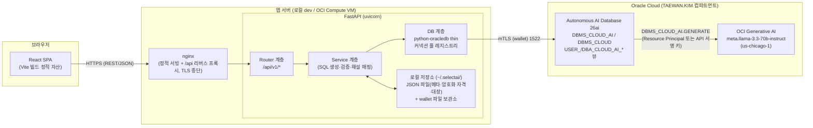
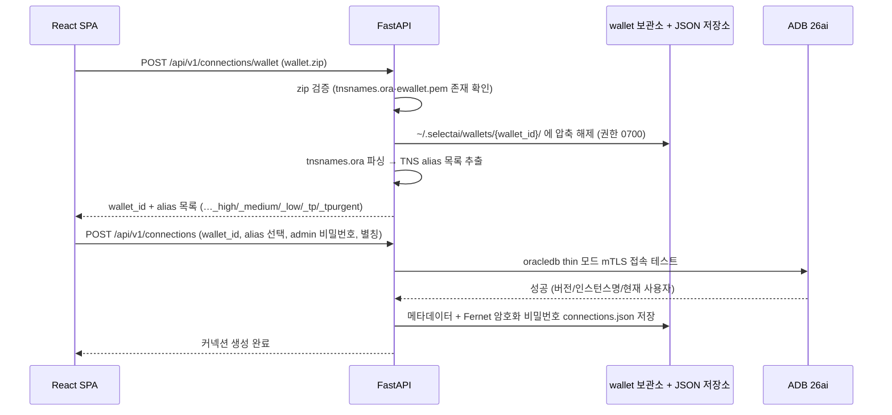
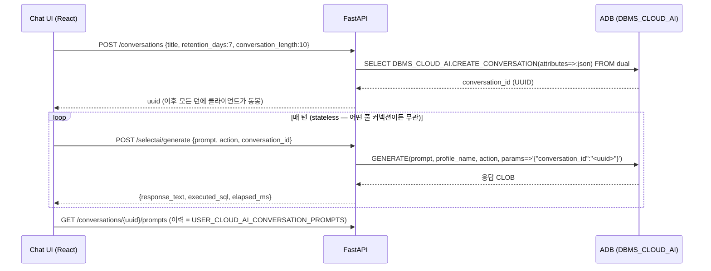
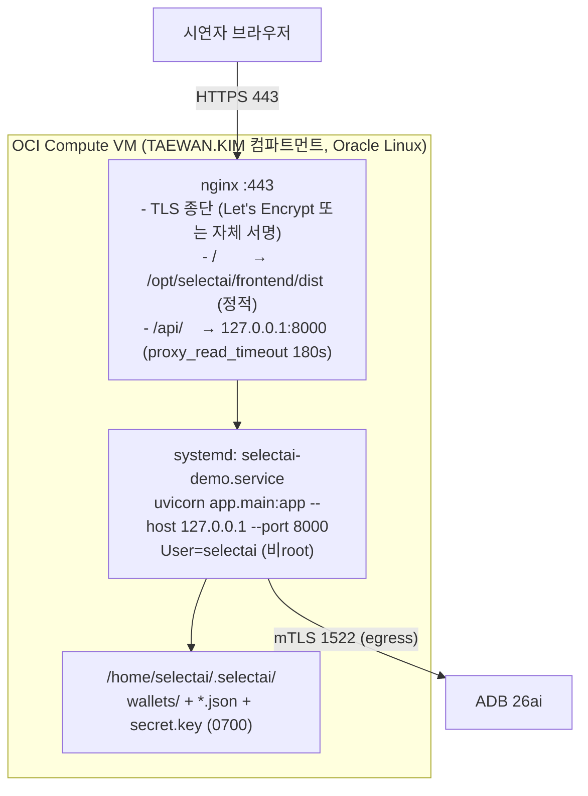

# Architecture — Select AI Demo Studio

| 항목 | 내용 |
|---|---|
| 문서 | architecture.md v1.0 (2026-06-12) |
| 작성자 | 솔루션 아키텍트 (전문가 3/8) |
| 상위 문서 | `PRD.md` (요구사항), `docs/research/selectai-reference.md` (기술 근거 — 이하 "레퍼런스") |
| 적용 범위 | PRD의 FR-01 ~ FR-09 전체. 모든 Select AI API/속성/권한 사실은 레퍼런스만을 근거로 함 |

---

## 0. 아키텍처 원칙 (전 컴포넌트 강제)

1. **Stateless 호출 패턴 강제 (PRD 리스크 R3)** — `SELECT AI` 키워드, `DBMS_CLOUD_AI.SET_PROFILE`, `SET_CONVERSATION_ID`는 **세션 상태**이므로 커넥션 풀 기반 stateless 백엔드에서 사용 금지 (레퍼런스 §1, §10-1). 모든 Select AI 실행은 단일 패턴으로 통일한다:
   ```sql
   SELECT DBMS_CLOUD_AI.GENERATE(
            prompt       => :prompt,
            profile_name => :profile_name,
            action       => :action,
            params       => :params_json   -- 예: '{"conversation_id":"<uuid>"}'
          ) AS response FROM dual
   ```
   코드 리뷰 체크 항목: `SET_PROFILE` / `SET_CONVERSATION_ID` / `select ai ` 문자열이 백엔드 실행 경로에 존재하면 머지 불가. SQL 미리보기는 화면 성격에 맞게 `GRANT`, ACL, `CREATE_PROFILE`, `GENERATE` 등을 보여줄 수 있으나, 세션 의존 패턴(`SET_PROFILE`, `SET_CONVERSATION_ID`)과 `SELECT AI` 키워드는 실행 UI에 노출하지 않는다.
2. **존재하지 않는 API 사용 금지** — `showparameter` 액션은 존재하지 않으며(레퍼런스 §1), 프로파일 속성 조회는 `USER/DBA_CLOUD_AI_PROFILE_ATTRIBUTES` 뷰로 구현한다. Resource Principal 활성화는 `DBMS_CLOUD_ADMIN.ENABLE_PRINCIPAL_AUTH(provider => 'OCI')`이다 (`ENABLE_RESOURCE_PRINCIPAL` 아님, 레퍼런스 §4.4).
3. **기본 프로파일은 앱 상태** — DB의 SET_PROFILE이 아니라 앱 설정 저장소(`settings.json`)에 저장하고, 매 호출에 `profile_name`을 명시 전달한다 (FR-05).
4. **실행 SQL 투명성** — 모든 실행성 API 응답에 실제 실행된 SQL 원문(`executed_sql`)을 포함한다 (파트너 페르소나 학습 효과, PRD FR 공통 요구).
5. **속성 화이트리스트** — 프로파일 폼 UI는 레퍼런스 §3에서 검증된 21개 속성만 제공하고, 그 외는 "고급 JSON 직접 입력"으로 격리한다 (리스크 R4).
6. **ACL 분기** — OCI GenAI는 ACL 불필요(레퍼런스 §4.2 p34). `DBMS_NETWORK_ACL_ADMIN.APPEND_HOST_ACE`는 외부 공급자 선택 시에만 실행한다.

---

## 1. 시스템 구성도



핵심 포인트:

- **LLM 호출은 전적으로 DB 내부에서 일어난다.** FastAPI는 OCI GenAI를 직접 호출하지 않고, ADB의 `DBMS_CLOUD_AI.GENERATE`를 SQL로 호출할 뿐이다. 따라서 백엔드에는 OCI SDK 의존성이 필요 없다. 단 하나의 예외는 **wallet 자동 다운로드(§3.1.1)** 로, 시연자 로컬에 설치된 **OCI CLI를 subprocess로 호출**한다 — 이 역시 SDK 의존성을 추가하지 않으며, CLI 미설치 시 업로드 경로로 폴백한다.
- 앱 서버의 영속 상태는 ① wallet 파일 보관소, ② JSON 파일 3종(`connections.json` 커넥션 메타·암호화 자격, `settings.json` 앱 설정, `resources.json` 생성 리소스 대장) 두 가지뿐이며, 모두 앱 데이터 디렉토리 **`~/.selectai/`** (0700) 아래에 둔다. ADB 측 상태(프로파일, 대화, 코멘트)는 전부 DB가 소유한다.
- OCI GenAI 호출 경로(인증·컴파트먼트·리전)는 프로파일 속성으로 결정되며, 기본값은 `provider=oci`, `model=meta.llama-3.3-70b-instruct`, `region=us-chicago-1`, `oci_compartment_id=ocid1.compartment.oc1..aaaaaaaaihv5qjkvzwovuc6bwm32ikrjjtz3syuevn47b44ssikueho2umxq` (TAEWAN.KIM).

---

## 2. 컴포넌트 설계

### 2.1 디렉토리 트리 (제안)

```
selectai_uis/
├── PRD.md
├── docs/
│   ├── architecture.md                  # 본 문서
│   └── research/selectai-reference.md
├── frontend/                            # React + TypeScript + Vite
│   ├── src/
│   │   ├── api/                         # API 클라이언트 (fetch 래퍼, 타입)
│   │   │   ├── client.ts
│   │   │   └── types.ts                 # 백엔드 Pydantic 스키마와 1:1 대응
│   │   ├── features/                    # FR 단위 모듈 (기능 = 폴더)
│   │   │   ├── connections/             # FR-01/02: wallet 업로드, 커넥션 CRUD/테스트
│   │   │   ├── prerequisites/           # FR-03: 권한 점검 체크리스트 + 원클릭 적용
│   │   │   ├── profiles/                # FR-04/05: 속성 폼(한국어 해설) + CRUD + 기본 지정
│   │   │   ├── actions/                 # FR-06: 액션 시연 (탭 전환, SQL 펼침)
│   │   │   ├── chat/                    # FR-07: 챗봇 + 맥락 비교 모드
│   │   │   ├── enrichment/              # FR-08: COMMENT 증강 전/후 비교
│   │   │   └── dashboard/               # FR-09: 데모 상태 신호등 (P1)
│   │   ├── components/                  # 공용 컴포넌트
│   │   │   ├── SqlPreview.tsx           # 실행/예정 SQL 펼침 표시 (원칙 4 구현체)
│   │   │   ├── ResultGrid.tsx           # runsql 결과 표
│   │   │   ├── KoreanHelpTip.tsx        # 속성/항목 한국어 해설 + 근거 페이지 툴팁
│   │   │   └── OraErrorPanel.tsx        # ORA 오류 → 한국어 해설 + 조치 버튼
│   │   ├── store/                       # 전역 상태 (Zustand): 활성 커넥션, 기본 프로파일
│   │   ├── preferences/                 # 단순/전문가 모드, SQL 투명 모드 등 localStorage UI 설정
│   │   └── App.tsx / routes.tsx
│   └── package.json
├── backend/                             # Python FastAPI (uv 관리)
│   ├── app/
│   │   ├── main.py                      # FastAPI 앱 팩토리, CORS, 예외 핸들러
│   │   ├── config.py                    # 환경변수 (pydantic-settings)
│   │   ├── routers/                     # HTTP 계층 — 입출력 스키마만, 로직 없음
│   │   │   ├── connections.py           # /api/v1/connections, /api/v1/connections/wallet
│   │   │   ├── prerequisites.py         # /api/v1/privileges (대상 커넥션은 X-Connection-Id 헤더)
│   │   │   ├── profiles.py              # /api/v1/profiles, /api/v1/settings/default-profile
│   │   │   ├── selectai.py              # /api/v1/selectai
│   │   │   ├── conversations.py         # /api/v1/chat/conversations, /api/v1/chat/compare
│   │   │   ├── enrichment.py            # /api/v1/enrichment, /api/v1/schema
│   │   │   ├── dashboard.py             # /api/v1/dashboard
│   │   │   └── resources.py             # /api/v1/resources (생성 리소스 대장 CRUD/정리)
│   │   ├── services/                    # 도메인 로직 — SQL 문자열 생성·검증·해설
│   │   │   ├── connection_service.py    # wallet 해제/검증, TNS alias 추출, 풀 수명주기
│   │   │   ├── prereq_service.py        # 점검 쿼리 실행, 적용 SQL 생성(미리보기=실행 동일 문자열)
│   │   │   ├── profile_service.py       # CREATE_PROFILE/SET_ATTRIBUTE(S)/DROP, 속성 화이트리스트 검증
│   │   │   ├── selectai_service.py      # GENERATE 단일 호출 경로 (이스케이프, latency 측정)
│   │   │   ├── conversation_service.py  # CREATE/UPDATE/DROP_CONVERSATION, 이력 뷰 조회
│   │   │   ├── enrichment_service.py    # 모호 스키마 시드, COMMENT DDL, 전/후 프로파일 쌍
│   │   │   ├── resource_service.py      # ledger(resources.json) CRUD, cleanup_sql 실행/파일 정리, 실패 격리
│   │   │   └── attribute_catalog.py     # 검증 21개 속성의 한국어 해설·기본값·근거 페이지 (정적 카탈로그)
│   │   ├── db/                          # 인프라 계층
│   │   │   ├── pool_registry.py         # connection_id → oracledb.ConnectionPool 레지스트리
│   │   │   ├── oracle.py                # 쿼리 실행 헬퍼 (bind, CLOB fetch, timeout)
│   │   │   └── local_store.py           # JSON 파일 저장소: connections.json·settings.json·resources.json 원자적 read/write
│   │   ├── security/
│   │   │   └── crypto.py                # Fernet 암호화 (비밀번호), 로그 마스킹 필터
│   │   ├── schemas/                     # Pydantic 요청/응답 모델
│   │   └── errors.py                    # ORA 오류 → 한국어 해설 매핑 테이블
│   ├── seeds/
│   │   ├── movie_schema.sql             # FR-08 모호 스키마(c1~c7) 테이블+시드 데이터
│   │   ├── movie_comments.sql           # COMMENT 증강 세트
│   │   └── movie_reset.sql              # COMMENT 제거 + 데모 테이블/프로파일 정리 보조
│   ├── pyproject.toml
│   └── tests/
└── deploy/
    ├── nginx.conf
    ├── selectai-demo.service            # systemd 유닛
    └── .env.example

~/.selectai/                             # 앱 데이터 디렉토리 (저장소 외부, 0700 — §3.3)
├── wallets/{wallet_id}/                 # 압축 해제된 wallet (업로드/자동 다운로드 공통, 각 0700)
├── connections.json                     # 커넥션 메타데이터 + Fernet 암호화 자격 (0600)
├── settings.json                        # 앱 설정 (기본 프로파일 등, 0600)
├── resources.json                       # 생성 리소스 대장(ledger) (0600)
└── secret.key                           # Fernet 키 (0600, APP_SECRET_KEY 미설정 시 자동 생성)
```

> 런타임 데이터는 저장소 내부(`backend/var/`)가 아니라 **홈 디렉토리의 앱 데이터 디렉토리 `~/.selectai/`** 에 둔다 (환경변수 `APP_DATA_DIR`로 변경 가능). wallet 저장 위치는 업로드·자동 다운로드 모두 `~/.selectai/wallets/{wallet_id}/`로 통일한다.

### 2.2 백엔드 레이어 규칙

| 레이어 | 책임 | 금지 사항 |
|---|---|---|
| `routers/` | HTTP 입출력, Pydantic 검증, 의존성 주입 | SQL 문자열 생성, 비즈니스 분기 |
| `services/` | SQL 생성·실행 오케스트레이션, 한국어 해설 결합, **미리보기 SQL과 실행 SQL을 동일 함수에서 생성** | HTTP 개념(상태코드 등), 풀 직접 생성 |
| `db/` | 커넥션 풀 관리, bind 실행, CLOB→str 변환, 타임아웃 | 도메인 지식 |
| `security/` | 자격 암호화/복호화, 로그 마스킹 | — |

미리보기/실행 동일성 보장: 각 service는 `build_sql(...) -> ExecutableSql(sql, binds, redacted_sql)` 형태의 순수 함수를 두고, "미리보기 API"는 `redacted_sql`(비밀값 마스킹)을 반환하고 "적용 API"는 같은 객체를 실행한다. 미리보기와 실제 실행이 어긋날 수 없는 구조다.

### 2.3 주요 API 표면 (요약)

> **API 계약의 단일 소스는 `docs/api-spec.md`** (42개 엔드포인트 전체 명세 + Pydantic 모델). 대상 커넥션은 경로 파라미터가 아니라 **`X-Connection-Id` HTTP 헤더**로 전달한다 (api-spec §1.2). 아래는 라우터 구성 파악용 요약.

```
POST   /api/v1/connections/wallet               # wallet zip 업로드(multipart) → wallet_id + TNS alias 목록
POST   /api/v1/connections/wallet/generate      # wallet 자동 다운로드(OCI CLI, §3.1.1) → wallet_id + alias 목록 + adb_ocid
POST   /api/v1/connections                      # 커넥션 생성(접속 검증 포함) / GET 목록 / PATCH·DELETE /{id}
POST   /api/v1/connections/{id}/test            # 5초 타임아웃 테스트

GET    /api/v1/privileges/check                 # 점검 결과 (pass/fail/not_applicable + fix_sql 미리보기)
POST   /api/v1/privileges/apply                 # 원클릭 적용 → 자동 재점검 결과 반환

GET    /api/v1/profiles/attribute-meta          # 검증 21개 속성 + 한국어 해설 (정적)
POST   /api/v1/profiles/preview                 # CREATE_PROFILE SQL 미리보기 (실행 안 함)
POST   /api/v1/profiles                         # CREATE_PROFILE / GET 목록 / GET·PATCH·DELETE /{name}
GET/PUT /api/v1/settings/default-profile        # 앱 수준 기본 프로파일 (settings.json 저장)

GET    /api/v1/selectai/actions                 # 액션 메타데이터 (+ suggested-prompts)
POST   /api/v1/selectai/generate                # {prompt, action, profile_name?, conversation_id?, row_limit}

POST   /api/v1/chat/conversations               # CREATE_CONVERSATION → uuid / GET 목록 / PATCH·DELETE /{id}
POST   /api/v1/chat/conversations/{id}/messages # 턴 실행 (params conversation_id) / GET 이력
POST   /api/v1/chat/compare                     # 맥락 유무 비교 (FR-07)

POST   /api/v1/enrichment/demo-schema           # 모호 스키마 원클릭 생성/초기화 (DELETE = 정리)
GET|PUT /api/v1/enrichment/comments             # COMMENT 조회/적용 (DDL 미리보기 포함)
POST   /api/v1/enrichment/profile-pair          # comments off/on 프로파일 쌍 자동 생성
POST   /api/v1/enrichment/compare               # 동일 프롬프트를 off/on 프로파일 쌍으로 병렬 실행

GET    /api/v1/schema/owners·tables·columns     # object_list 브라우저/코멘트 편집 지원
GET    /api/v1/dashboard/health                 # FR-09 신호등 집계
GET    /api/v1/resources                        # 생성 리소스 대장 목록 조회 (status/type 필터)
DELETE /api/v1/resources/{id}                   # 개별 리소스 정리
POST   /api/v1/resources/cleanup                # 선택 대상 일괄 정리 실행 + 항목별 결과 반환
```

`runsql` 처리 주의: `GENERATE(action=>'runsql')`은 결과를 텍스트/CLOB로 반환하므로 표(grid) 표시는 다음 2단계로 구현한다 — ① `action=>'showsql'`로 SQL 획득 → ② 백엔드가 해당 SELECT를 검증(SELECT 단일문만 허용, 행수 제한 `row_limit` — 기본 100·최대 1000, api-spec §5.2 — 래핑) 후 직접 실행해 컬럼/행을 JSON으로 반환. 응답에는 ①의 GENERATE SQL과 ②의 실행 SQL을 모두 `executed_sql[]`로 노출한다.

단순/전문가 모드, SQL 투명 모드, 가이드 투어 재표시 여부 같은 UI preference는 서버 API를 만들지 않고 프런트 `localStorage`에 저장한다(X4 결정). 백엔드 영속이 필요한 앱 설정은 커넥션별 기본 프로파일뿐이며, 이는 위 `GET/PUT /api/v1/settings/default-profile`만 사용한다.

---

## 3. DB 연결 아키텍처

### 3.1 Wallet 수명주기 (FR-01)



- **thin 모드 고정**: python-oracledb thin 모드는 Oracle Client 라이브러리 설치 없이 mTLS wallet(`ewallet.pem` + `wallet_password` 또는 PEM 무비밀번호) 접속을 지원한다. OCI Compute 배포 시 외부 바이너리 의존성이 사라지므로 thick 모드는 사용하지 않는다.
- 접속 파라미터: `oracledb.create_pool(user="admin", password=<복호화>, dsn=<alias>, config_dir=<wallet_dir>, wallet_location=<wallet_dir>, wallet_password=<있을 경우>)`.
- TNS alias 추출은 `config_dir` 지정 후 `tnsnames.ora`를 정규식 파싱(`^\s*(\w+)\s*=`)하여 목록화한다.

### 3.1.1 Wallet 자동 다운로드 — OCI CLI 경로 (FR-01 하위 기능)

wallet zip이 수중에 없는 시연자를 위해, 커넥션 위저드 1단계에서 "업로드" 대신 **"OCI에서 자동 다운로드"** 경로를 제공한다 (`POST /api/v1/connections/wallet/generate`, api-spec §2.7). 백엔드가 **로컬 OCI CLI를 subprocess로 호출**한다 (사용자 확정 사항 — SDK가 아닌 CLI 방식).

**입력**: ADB 표시 이름(display name), wallet 암호(다운로드 zip에 설정할 암호), 컴파트먼트 OCID(기본값: `TAEWAN.KIM` — CLAUDE.md 전역 규칙 "모든 OCI 작업은 TAEWAN.KIM 컴파트먼트"와 일치, 변경 가능 필드), OCI CLI 프로파일(기본 `DEFAULT`).

**처리 순서**:

```bash
# ① ADB OCID 조회 — 컴파트먼트 + 표시 이름으로 검색
oci db autonomous-database list \
  --compartment-id <compartment_ocid> \
  --display-name <adb_display_name> \
  --lifecycle-state AVAILABLE

# ② wallet 다운로드 — ~/.selectai/wallets/{wallet_id}/wallet.zip
oci db autonomous-database generate-wallet \
  --autonomous-database-id <adb_ocid> \
  --file <path>/wallet.zip \
  --password <wallet_pw>          # 로그에는 ***MASKED*** 로 기록 (security.md §2.3)
```

- ① 결과가 **0건**이면 오류("해당 이름의 ADB를 찾을 수 없습니다"), **복수 건**이면 후보 목록(표시 이름·OCID·워크로드 타입)을 반환해 사용자가 선택한 뒤 재호출한다.
- ② 완료 후에는 **기존 업로드 경로와 동일하게 합류**한다: 압축 해제(`~/.selectai/wallets/{wallet_id}/`, 0700) → 평문 zip 즉시 삭제 → `tnsnames.ora` 파싱 → `wallet_id` + alias 목록 반환. 이후 §3.1 시퀀스의 `POST /api/v1/connections` 단계는 두 경로가 완전히 동일하다.
- **사전 조건**: 시연자 로컬에 OCI CLI 설치 + `~/.oci/config` 인증 구성. CLI 미설치/인증 실패 시 한국어 오류 메시지("OCI CLI가 설치되어 있지 않습니다. 수동 업로드를 이용하거나 설치 가이드를 참조하세요")와 함께 **업로드 경로로 폴백을 유도**한다. `~/.oci` 인증 자체는 앱이 관리하지 않는다 (security.md §2.5).
- subprocess는 `asyncio.create_subprocess_exec`로 비차단 실행하고, 단계별 타임아웃(조회 30초 / 다운로드 120초)을 둔다. 실행된 CLI 명령은 `--password` 값을 마스킹한 원문으로 응답 envelope에 노출한다 (api-spec §2.7).

### 3.2 커넥션 풀 전략 (다중 커넥션 동시 관리)

| 결정 | 내용 | 근거 |
|---|---|---|
| 풀 단위 | **저장된 커넥션(connection_id) 1개당 풀 1개**, `pool_registry`가 dict로 관리 | 데모 중 커넥션 전환·비교가 잦음 |
| 풀 크기 | `min=0, max=4, increment=1` (소형), `getmode=POOL_GETMODE_WAIT`, `wait_timeout=10s` | 단일 시연자 가정 (PRD 비목표), GENERATE는 LLM 지연으로 수십 초 점유 가능하므로 2~4개면 충분 |
| 지연 생성 | 첫 요청 시 풀 생성(lazy), 30분 미사용 시 풀 close (백그라운드 타이머) | 다중 커넥션 등록 시 자원 낭비 방지 |
| 세션 위생 | 모든 요청은 `acquire()` → 실행 → `release()`. 세션 상태를 남기는 호출 금지 (원칙 1) — 풀 재사용 시 상태 오염 원천 차단 | 리스크 R3 |
| 타임아웃 | 일반 쿼리 `call_timeout=15s`, GENERATE 계열 `call_timeout=120s`(환경변수로 조정), 커넥션 테스트 5s | FR-02 수용 기준, LLM 지연 허용 |
| 헬스 체크 | 테스트 버튼 = `SELECT 1 FROM dual` + `v$instance` 메타 조회 | FR-01 수용 기준 |

LLM 호출(GENERATE)이 DB 커넥션을 길게 점유하는 점이 이 아키텍처의 주된 병목이다. FastAPI는 `async def` 핸들러에서 `asyncio.to_thread()`(또는 oracledb async API)로 블로킹 실행을 격리해 이벤트 루프를 보호한다.

### 3.3 자격 정보 저장 (오픈 이슈 O2 결정)

- **저장소**: JSON 파일 3종 (`~/.selectai/connections.json`, `settings.json`, `resources.json`). 별도 DB 서버·드라이버 불필요, 단일 시연자 도구에 충분하며 사람이 직접 열어 검사·편집할 수 있어 데모 디버깅에 유리하다. 쓰기는 **임시 파일 작성 후 `os.replace` 원자적 교체** + 프로세스 내 `asyncio.Lock`(파일별)로 동시 쓰기 손상을 막는다 (단일 워커 전제, §11). 각 파일 권한 0600.
- **앱 데이터 디렉토리**: JSON 저장소·wallet·키 파일은 모두 `~/.selectai/` (디렉토리 0700, `APP_DATA_DIR`로 변경 가능) 아래에 통일 보관한다.
- **암호화**: admin 비밀번호·wallet 비밀번호는 `cryptography` Fernet(AES-128-CBC+HMAC) 대칭 암호화. 키는 환경변수 `APP_SECRET_KEY`(없으면 최초 기동 시 `~/.selectai/secret.key` 자동 생성, 0600).
- **wallet 파일**: 평문 zip은 즉시 삭제, 해제본은 `~/.selectai/wallets/{wallet_id}/` (0700)에 보관 — 업로드분과 자동 다운로드분(§3.1.1) 공통. 커넥션 삭제 시 디렉토리 제거(다른 커넥션이 참조하지 않을 때).
- **로그 마스킹**: logging Filter로 `password`, `wallet_password`, `private_key` 키를 가진 값과 Fernet 토큰 패턴을 `***`로 치환. API 응답 스키마에는 비밀 필드 자체를 두지 않는다 (PRD R5).
- 한계 명시: 키와 암호문이 같은 호스트에 있으므로 프로덕션급 보호가 아니다 — PRD 비목표(프로덕션 보안)와 일치하는 "최소선"이다. OCI Vault 연동은 P2 이후 검토.

### 3.3.1 생성 리소스 대장(ledger) — FR-10 / X2 결정

고객 환경에서 `admin` 계정으로 시연하므로, 앱이 만든 흔적을 지우지 못하면 MVP 결격 사유다. `local_store.py`는 `~/.selectai/resources.json`에 대장 항목 배열을 두고, 생성·변경 작업이 성공한 직후 아래 정보를 한 항목으로 기록한다. `resource_service.py`가 이 파일에 대한 CRUD(추가/조회/개별 정리/일괄 정리)를 담당한다.

| 컬럼 | 설명 |
|---|---|
| `id` | ledger 항목 ID (`led_<uuid>`) |
| `connection_id` | 대상 커넥션 |
| `resource_type` | `profile`, `credential`, `acl`, `conversation`, `demo_table`, `grant`, `wallet`, `connection` 등 |
| `resource_name` / `owner` | DB 객체명 또는 파일/앱 리소스 이름 |
| `create_sql` | 생성/변경 시 실행 SQL 또는 작업 설명(비밀값 마스킹) |
| `cleanup_sql` | 정리 시 실행할 SQL/작업 설명(비밀값 마스킹) |
| `cleanup_order` | 의존성 순서. 대화 → 프로파일/벡터 인덱스 → credential/ACL/grant → 데모 테이블 → 앱 파일 순 |
| `cleanup_status` | `pending`, `done`, `failed`, `skipped` |
| `created_at` / `cleaned_at` / `last_error` | 감사와 재시도용 메타데이터 |

`resource_service`는 `GET /api/v1/resources`에서 정리 후보와 SQL 미리보기를 반환하고, `DELETE /api/v1/resources/{id}`에서 개별 항목을, `POST /api/v1/resources/cleanup`에서 선택 항목을 `cleanup_order` 순으로 실행한다. 한 항목이 실패해도 나머지 정리를 계속하고, 실패 사유를 ledger에 남긴다. 파일 삭제(wallet/해제 디렉토리)는 SQL이 아닌 `cleanup_action`으로 기록하되 응답에는 사용자에게 보이는 작업 설명을 반환한다.

### 3.4 권한 점검 아키텍처 (FR-03)

`prereq_service`는 점검 항목을 선언적 카탈로그로 정의한다. 각 항목 = `{id, 제목, 한국어 설명, 점검 SQL, 판정 함수, 적용 SQL 빌더, 적용 가능 여부, 우선순위}`.

| 항목 ID | 점검 | 적용 (원클릭) | 분기 |
|---|---|---|---|
| `execute_grant` | `DBA_TAB_PRIVS`에서 `DBMS_CLOUD_AI` EXECUTE (레퍼런스 §4.1 p35 쿼리 그대로) | `GRANT EXECUTE ON DBMS_CLOUD_AI TO <user>` | admin 접속 시 "해당없음(통과)" 처리 가능하나 시연용으로 항상 표시 |
| `credential` | `DBA_CREDENTIALS`에서 지정 credential 존재 (또는 `OCI$RESOURCE_PRINCIPAL` 경로) | `DBMS_CLOUD.CREATE_CREDENTIAL(user_ocid/tenancy_ocid/private_key/fingerprint)` | O1 결정에 따라 기본은 Resource Principal |
| `resource_principal` | `ENABLE_PRINCIPAL_AUTH` 적용 여부 (credential `OCI$RESOURCE_PRINCIPAL` 사용 가능성 점검) | `DBMS_CLOUD_ADMIN.ENABLE_PRINCIPAL_AUTH(provider => 'OCI')` | Dynamic Group/IAM 정책은 DB 밖 — "수동 확인 안내" 카드로 표시 |
| `data_access` | Data Access 활성 여부 — narrate 무해 프로브 또는 설정 조회로 판정, `ORA-20000` 검출 시 비활성 | `DBMS_CLOUD_AI.ENABLE_DATA_ACCESS` (레퍼런스 §2 p174–176) | 비활성 시 narrate/합성데이터 경고 (R2) |
| `acl_<provider>` | 외부 공급자 host로의 ACL 존재 (`DBA_HOST_ACES`) | `DBMS_NETWORK_ACL_ADMIN.APPEND_HOST_ACE(host => <공급자 host>)` | **provider=oci면 "필요 없음(통과)" 자동 처리** |
| `feedback_grants` (P1) | `SYS.V_$MAPPED_SQL` / `SYS.V_$SESSION` READ | `GRANT READ ON SYS.V_$MAPPED_SQL TO <user>` 등 | FR-06 feedback 활성화 시에만 표시 |
| `demo_schema` | SH 접근 가능 여부 + FR-08 모호 스키마 존재 | `seeds/movie_schema.sql` 실행 | FR-09 대시보드와 공유 |

적용 플로우: 점검 → 실패 항목의 적용 SQL 미리보기(`redacted_sql`) 표시 → 사용자 확인 → 실행 → **자동 재점검** 결과 반환 (FR-03 수용 기준).

---

## 4. Select AI 호출 전략

### 4.1 `SELECT AI` 구문 vs `DBMS_CLOUD_AI.GENERATE` 비교와 선택

| 기준 | `SELECT AI <action> <prompt>` | `DBMS_CLOUD_AI.GENERATE(...)` |
|---|---|---|
| 프로파일 지정 | 세션의 `SET_PROFILE` 필요 (세션 상태) | `profile_name` 파라미터로 매 호출 명시 |
| 대화 맥락 | 세션의 `SET_CONVERSATION_ID` 필요 | `params => '{"conversation_id":"..."}'` |
| 커넥션 풀 호환 | **불가** — 풀 재사용 시 다른 요청의 프로파일/대화가 누설되거나 미설정 오류(`ORA-00923`) | 완전 호환 (무상태) |
| 바인드 변수 | 프롬프트가 SQL 텍스트의 일부 → 바인드 불가, 이스케이프 수작업 | `prompt`/`profile_name` 등 전부 바인드 가능 |
| 도구 제약 | Database Actions/APEX 미지원 (레퍼런스 §1 p44) | 제약 없음 |
| 결과 형태 | runsql은 실제 결과셋 | CLOB 텍스트 반환 (runsql 표 표시는 §2.3의 2단계 처리) |

**결정: 전 기능 `GENERATE` 단일 패턴.** `SELECT AI` 구문은 UI의 "학습용 보기"에서 참고 문자열로만 표시한다(실행하지 않음).

### 4.2 바인딩/이스케이프 처리

- **원칙: 문자열 연결 금지, 전부 바인드 변수.** `prompt`, `profile_name`, `action`, `params`를 `:1, :2, :3, :4` 바인드로 전달하므로 SQL 인젝션과 작은따옴표 문제(레퍼런스 §1 p45의 `''` 이중 입력)는 호출 경로에서 원천적으로 발생하지 않는다. FR-06의 "작은따옴표 자동 이스케이프" 수용 기준은 바인드 사용으로 충족되며, **화면에 노출하는 `executed_sql` 문자열을 만들 때만** 리터럴 표기를 위해 `'` → `''` 치환을 적용한다.
- `params` JSON은 백엔드가 `json.dumps()`로 직렬화한다 (사용자 입력을 JSON 문자열에 수작업 삽입 금지).
- `action`은 Enum 화이트리스트(`runsql, showsql, explainsql, narrate, chat, showprompt, feedback, summarize, translate`)로 검증 — 존재하지 않는 액션(예: showparameter)은 422 응답.
- 바인드가 불가능한 위치(프로파일명·테이블명 등 식별자 — CREATE_PROFILE의 `profile_name`, COMMENT DDL의 객체명)는 식별자 검증(`^[A-Za-z][A-Za-z0-9_$#]{0,127}$`) 후 사용하고, COMMENT 본문은 `'` 이중화 처리한다.
- CLOB 응답은 `oracledb.defaults.fetch_lobs = False`로 str 직취득.

### 4.3 응답 공통 스키마

```json
{
  "data": {
    "action": "runsql",
    "profile_name": "GENAI",
    "response_text": null,           // showsql/explainsql/narrate/chat/showprompt 시 CLOB 전문
    "generated_sql": "SELECT ...",
    "columns": ["..."], "rows": [["..."]]   // runsql 전용 (row_limit 적용)
  },
  "executed_sql": [
    "SELECT DBMS_CLOUD_AI.GENERATE(prompt => '...', profile_name => 'GENAI', action => 'showsql') FROM dual",
    "SELECT ... -- row_limit 100"
  ],
  "elapsed_ms": 4210
}
```

> 필드 상세(envelope 구조, 오류 객체 포맷)는 `docs/api-spec.md` §1.3·§1.4·§5.2가 단일 기준이다.

오류 매핑(`errors.py`): `ORA-00923`(프로파일 미지정 상태의 SELECT AI — 발생 시 패턴 위반 신호), `ORA-20000`(Data Access 비활성 → FR-03 복구 버튼 딥링크), credential/ACL 계열, LLM 환각으로 인한 SQL 실행 실패(재시도 버튼, R1) 등을 한국어 해설과 함께 반환한다.

---

## 5. 챗봇(Conversations) 상태 관리

### 5.1 conversation_id 수명주기



- **대화 상태의 소유자는 ADB다.** 백엔드는 conversation_id를 저장하지 않고 통과시키며(stateless), 클라이언트(Zustand store)가 활성 uuid를 보관한다. 새로고침 시 `USER_CLOUD_AI_CONVERSATIONS` 조회로 복구한다.
- 턴별 액션 선택: 대화 지원 액션은 `runsql/showsql/explainsql/narrate/chat`(레퍼런스 §6 p47 Note). UI 기본값 `narrate`(데이터 서술) — Data Access 비활성 환경 감지 시 `chat`으로 폴백 제안.
- **맥락 비교 모드 (FR-07)**: 동일 prompt를 ① `params` 없이, ② `conversation_id` 포함으로 2회 호출해 좌우 병렬 표시 (레퍼런스 p132 근거). 두 호출은 `asyncio.gather`로 병렬 실행.
- 프로파일의 `conversation:"true"`(세션 단기 대화)는 사용하지 않는다 — 명시적 conversation_id가 있으면 무시되는 속성이고(레퍼런스 §6), 세션 의존이라 원칙 1 위반.

### 5.2 보관 정책 (오픈 이슈 O4 결정)

- 기본 `retention_days: 7`, `conversation_length: 10`. 새 대화 폼에서 변경 가능.
- 자동 정리: 데모 종료 시 자동 삭제는 하지 않는다(시연 후 이력 리뷰 가치). 대화 목록 화면에 "오래된 대화 일괄 삭제(`DROP_CONVERSATION`)" 버튼만 제공하고, 만료는 ADB의 retention_days에 위임한다.

### 5.3 스트리밍 여부 — **비스트리밍 확정**

`DBMS_CLOUD_AI.GENERATE`는 완성된 CLOB을 반환하는 SQL 함수라 토큰 스트리밍이 불가능하다(레퍼런스에 스트리밍 인터페이스 없음). 가짜 스트리밍(서버에서 받은 전문을 잘라 흘리기)은 지연 인식을 왜곡하므로 채택하지 않는다. 대신:

- 요청 즉시 "생성 중" 단계 표시(프로파일→LLM 호출 중)와 경과 시간 타이머.
- 응답에 `elapsed_ms`를 항상 표기 (FR-06 수용 기준, api-spec §1.3).
- HTTP는 단순 JSON 응답(요청당 1회). SSE/WebSocket은 도입하지 않아 nginx/배포 구성도 단순해진다.

---

## 6. 로컬 개발 환경과 OCI Compute 배포

### 6.1 로컬 개발

```bash
# backend (uv)
cd backend && uv sync && uv run uvicorn app.main:app --reload --port 8000
# frontend (Vite dev server, /api → 8000 프록시)
cd frontend && npm install && npm run dev   # http://localhost:5173
```

- Vite `server.proxy`로 `/api` → `http://localhost:8000` 프록시 → CORS 설정 불필요(동일 출처). 로컬에서도 배포와 동일한 경로 구조 유지.
- ADB는 로컬에서도 실제 OCI 인스턴스(mTLS wallet) 사용 — 모킹 없음. 단위 테스트만 oracledb를 스텁.

### 6.2 OCI Compute 배포 (오픈 이슈 O5 결정)

**형태: 단일 VM + nginx(리버스 프록시/TLS) + systemd 관리 uvicorn. Docker는 채택하지 않는다** — 단일 VM·단일 앱에서 컨테이너 레이어는 운영 이점보다 wallet/JSON 저장소 볼륨 관리 복잡도만 더한다 (트레이드오프는 §7).



- **네트워크**: OCI Security List/NSG에서 ingress는 443(+22 관리)만 개방. uvicorn은 루프백 바인딩으로 외부 비노출. egress는 ADB 1522.
- **HTTPS 범위**: 외부 구간(브라우저↔nginx)만 TLS. 데모 도구 특성상 공인 도메인이 없으면 자체 서명 + 브라우저 예외로 충분(PRD 비목표와 정합). nginx `client_max_body_size 20m`(wallet 업로드).
- **systemd**: `Restart=on-failure`, `EnvironmentFile=/opt/selectai/backend/.env`, `WorkingDirectory` 고정. 프론트엔드는 CI 없이 `npm run build` 산출물(dist) rsync 배포.
- **타임아웃 정합**: nginx `proxy_read_timeout` ≥ 백엔드 `SELECTAI_CALL_TIMEOUT`(120s) + 여유 60s.

### 6.3 환경변수 설계 (`deploy/.env.example`)

| 변수 | 기본값 | 설명 |
|---|---|---|
| `APP_ENV` | `local` | `local` / `prod` (로그 레벨·문서 노출 제어) |
| `APP_SECRET_KEY` | (자동 생성) | Fernet 키. 미설정 시 `~/.selectai/secret.key` 생성 |
| `APP_DATA_DIR` | `~/.selectai` | 앱 데이터 디렉토리 루트 (wallets/·connections.json·settings.json·resources.json·secret.key, 0700) |
| `OCI_CLI_PROFILE` | `DEFAULT` | wallet 자동 다운로드(§3.1.1) 시 사용할 `~/.oci/config` 프로파일 |
| `DB_POOL_MAX` | `4` | 커넥션당 풀 최대 세션 |
| `DB_CALL_TIMEOUT_MS` | `15000` | 일반 쿼리 call_timeout |
| `SELECTAI_CALL_TIMEOUT_MS` | `120000` | GENERATE 계열 call_timeout |
| `DEFAULT_OCI_COMPARTMENT_ID` | TAEWAN.KIM OCID (`ocid1.compartment.oc1..aaaaaaaaihv5qjkvzwovuc6bwm32ikrjjtz3syuevn47b44ssikueho2umxq`) | 프로파일 `oci_compartment_id` 기본값 |
| `DEFAULT_OCI_REGION` | `us-chicago-1` | 프로파일 `region` 기본값 |
| `DEFAULT_MODEL` | `meta.llama-3.3-70b-instruct` | 프로파일 `model` 기본값 |
| `CONVERSATION_RETENTION_DAYS` | `7` | 새 대화 기본 보관일 |

비밀(DB 비밀번호 등)은 환경변수가 아닌 JSON 저장소(`connections.json`)에 Fernet 암호화 저장(§3.3) — `.env`에는 키·기본값만 둔다.

### 6.4 OCI GenAI 인증 기본값 (오픈 이슈 O1 결정)

- **UI 기본값: Resource Principal** (`DBMS_CLOUD_ADMIN.ENABLE_PRINCIPAL_AUTH(provider=>'OCI')` + `credential_name: "OCI$RESOURCE_PRINCIPAL"`). 근거: API 키 4종 입력이 불필요해 비개발자 페르소나(P2)에 적합하고, ACL·키 회전 관리가 없다 (레퍼런스 §5 "데모 환경에 적합").
- 단, Resource Principal은 **테넌시 Dynamic Group + `manage generative-ai-family` 정책 선행**이 필요하다(레퍼런스 §4.4) — DB 안에서 점검 불가하므로 FR-03에서 "OCI 콘솔 수동 확인" 안내 카드 + 실패 시(GENERATE 호출 인증 오류) API 서명 키 방식으로 전환하는 폴백 UX를 제공한다. 두 방식 모두 폼 지원.

### 6.5 데모 스키마 시드 (오픈 이슈 O3 결정)

- SH 스키마: ADB 기본 제공 샘플(`SH` 스키마) **존재를 점검만** 하고 생성하지 않는다(FR-03 `demo_schema` 항목). 없으면 추천 프롬프트 버튼을 비활성화하고 안내.
- P0 데이터셋은 SH + FR-08 모호 무비 스키마만 사용한다. 한국형 `SALES_DEMO`는 PDF 근거 없는 자체 설계라 MVP 데모 실패 리스크를 늘리므로 P1로 보류한다.
- FR-08 모호 무비 스키마는 `backend/seeds/` 아래 3파일 체계로 관리한다.
  - `movie_schema.sql`: admin 스키마 하위에 `TABLE1(c1,c2,c3)`·`TABLE2(c1,c6,c7)`·`TABLE3(c1,c4,c5)` 형태(레퍼런스 §7 ch19 패턴, api-spec §7.1과 동일 레이아웃)로 테이블과 정적 시드 데이터 생성.
  - `movie_comments.sql`: `COMMENT ON TABLE/COLUMN` 증강 문구 적용. 데모 ③ COMMENT 적용 단계에서 사용.
  - `movie_reset.sql`: COMMENT 제거, 데모 테이블/프로파일 쌍 정리 보조. Cleanup API와 PG-08 정리 화면에서도 참조.
  - 합성 데이터 생성(`GENERATE_SYNTHETIC_DATA`) 연동은 P2.

---

## 7. 기술 선택 근거와 트레이드오프

| # | 결정 | 근거 | 트레이드오프 (수용 이유) |
|---|---|---|---|
| 1 | **GENERATE 단일 호출 패턴** (SELECT AI 구문 전면 배제) | 커넥션 풀 stateless 호환, 바인드 변수 가능, Database Actions 제약 무관 (레퍼런스 §1, §10-1) | `SELECT AI` 고유의 "한 줄 SQL" 데모 감성은 잃음 → UI에 참고용 구문 표시로 보완 |
| 2 | **python-oracledb thin 모드** | Oracle Client 설치 불필요 → OCI Compute 배포 단순화, mTLS wallet 지원 충분 | thick 전용 고급 기능 미사용 가능 — 본 앱 요구사항에 해당 없음 |
| 3 | **runsql 2단계 실행** (showsql → 백엔드 직접 실행) | GENERATE의 runsql은 CLOB 텍스트라 표(grid) 표시 불가, 행수 제한·컬럼 메타 확보 필요 | LLM 호출 후 SQL 실행이 분리되어 호출 1회 추가 → `executed_sql[]`로 투명하게 노출해 학습 효과로 전환 |
| 4 | **풀-퍼-커넥션 레지스트리** (전역 풀 1개 아님) | 다중 저장 커넥션 간 즉시 전환·비교 데모 요구 | 메모리 점유 증가 → min=0 lazy 생성 + 30분 유휴 close로 완화 |
| 5 | **JSON 파일 + Fernet 로컬 저장** (외부 DB/Vault 없음) | 단일 시연자·단일 VM 도구, 설치 0스텝, 사람이 직접 검사 가능, PRD 비목표(프로덕션 보안)와 정합 | 키·암호문 동일 호스트 → 한계를 문서화(§3.3)하고 R5 최소선(암호화+로그 마스킹) 충족 |
| 6 | **비스트리밍 응답** | GENERATE가 CLOB 일괄 반환 — 진짜 토큰 스트리밍 불가, SSE 도입은 복잡도만 증가 | 긴 응답 대기 체감 → 경과 타이머 + latency 표기 + 단계 표시로 완화 |
| 7 | **systemd + nginx (Docker 미채택)** | 단일 VM·단일 앱, wallet/JSON 저장소 영속 볼륨 직관적, Oracle Linux 표준 운영 | 환경 재현성은 Docker가 우위 → `deploy/` 스크립트·.env.example로 재현성 보완, 필요 시 P2에서 컨테이너화 |
| 8 | **Resource Principal 기본 인증** | 비밀 입력 최소화(P2 페르소나), ACL·키 관리 불필요 (레퍼런스 §5) | 테넌시 IAM 선행 작업 필요 → FR-03 수동 안내 카드 + API 서명 키 폴백 |
| 9 | **React + Vite + Zustand, feature-folder 구조** | FR 단위 모듈화로 P0→P1 증분 개발 용이, 전역 상태는 활성 커넥션/기본 프로파일 2개뿐이라 경량 스토어로 충분 | Redux 류 대비 미들웨어 생태계 약함 — 본 앱 규모에서 불필요 |
| 10 | **속성 카탈로그 정적 코드화** (`attribute_catalog.py`) | 검증 21개 속성의 한국어 해설·근거 페이지를 단일 소스로 관리 (FR-04 100% 커버리지 측정 가능) | DB의 신규 속성 자동 반영 불가 → 의도된 화이트리스트(R4), 미검증 속성은 "고급 JSON" 입력으로 우회 제공 |

---

## 8. 오픈 이슈 처리 현황 (PRD §9 위임분)

| 이슈 | 결정 | 위치 |
|---|---|---|
| O1 인증 기본값 | Resource Principal 기본 + API 서명 키 폴백 | §6.4 |
| O2 자격 저장 방식 | JSON 파일(connections.json) + Fernet, wallet 파일 보관소, 로그 마스킹 | §3.3 |
| O3 데모 스키마 시드 | SH는 점검만, 모호 스키마는 백엔드 시드 스크립트 소유 | §6.5 |
| O4 대화 보관 정책 | retention_days 기본 7일, 자동 삭제 없음(수동 일괄 삭제 제공) | §5.2 |
| O5 배포 형태 | 단일 VM + nginx/systemd, 443만 개방, HTTPS는 외부 구간 | §6.2 |
